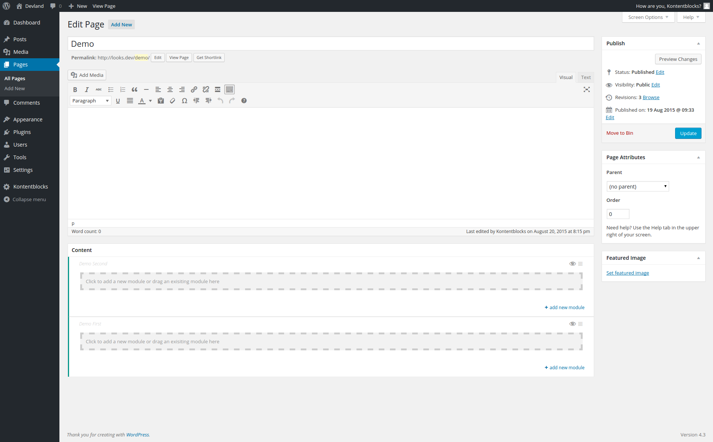

*Getting Started*

## Add areas to your theme


You're going to add to areas to the `normal` context.  

Add the following code two your `kontentblocks.php` file:

```php
\Kontentblocks\registerArea(
    array(
        'id' => 'demo-first', // unique id of area used in do_action('area',...) call
        'name' => 'Demo First', // public shown name
        'postTypes' => array( 'page' ), // array of post types where this area is available to
        'pageTemplates' => array( 'default' ), // array of page template names where this area is available to (AND relation)
        'context' => 'normal' // location on the edit screen
    )
);

\Kontentblocks\registerArea(
    array(
        'id' => 'demo-second',
        'name' => 'Demo Second',
        'postTypes' => array( 'page' ), 
        'pageTemplates' => array( 'default' ),
        'context' => 'normal'
    )
);```

This will add two areas with the given id to the post-type 'page' when no special page template is selected.  

There is an alternative wrapper function you can use:
`kb_register_area($args)`


#### Result

The edit screen of a page should now look like this:




Next step is to create your first module.
