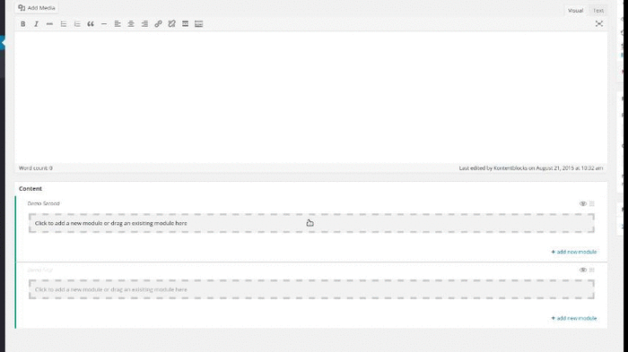

*Getting Started*

##Create a basic module

###Conventions

Kontentblocks looks for valid modules in all registered paths.  

##### Rules for a valid module

**Rule #1:** one folder per module  
**Rule #2:** folder name starts with *Module*  
**Rule #3:** main module file starts with *Module*  
**Rule #4:** class name equals file name

##### Naming 
I prefer PascalCase but using underscores is totally fine, so do as you please.


##Setup directory and files

In an earlier step you've registered a `/modules/` path in your themes root folder.  
Inside of this folder, create the following:

- modules/ (registered path) 
    - ModuleDemo
        - ModuleDemo.php


##Module sceleton

Open up the `ModuleDemo.php` and paste the following:
```php
<?php

use Kontentblocks\Modules\Module;

/**
 * Class ModuleDemo
 */
class ModuleDemo extends Module
{
    public static $settings = array(
        'publicName' => 'Demo Module',
        'name' => 'Demo Module',
        'views' => true,
        'connect' => array( 'normal' ),
        'id' => 'demo-module'
    );

    public function render()
    {
        return $this->view->render();
    }

}```

If you now click on the "add a module" link at the bottom right corner of an area, you should see something like this:



Clicking on the entry will add the module to the area.  
As you can tell from the class code, there is no form configured yet.