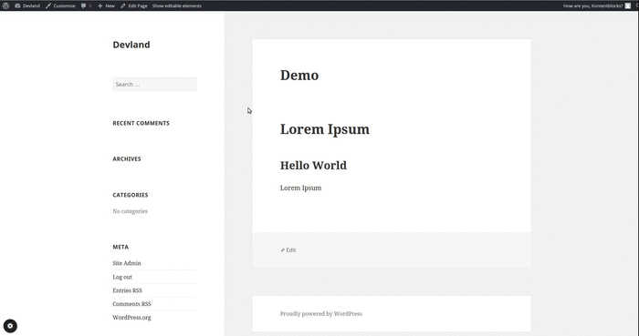
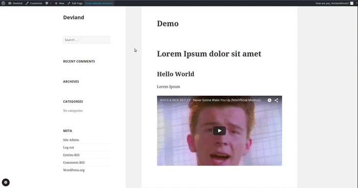

*Getting started*

##Setup inline editing

Each module comes automatically with front-end controls which is accessible when "Show editable elements" is turned on in the admin bar.



Essentially this opens the module form in a modal and replaces the module fragment after content has changed.

When using built-in fields, some field types support inline editing. By now, they are:

- text, textarea, editor
- image
- link

But this does not happen without further configuration.  
When setting up fields, there is a special `returnObj` parameter, which is not used by default.  
ReturnObjects are special classes which can be used to extend/augment a field value before it arrives at the frontend.  
In the current configuration the `Model.headline` simply  contains the "raw" input data, a string of text.

####Change field value to special ReturnObject

Open up your `DemoModule.php` file and revisit the `fields()` method, change it like this:

   public function fields()
    {

        /** @var FieldSection $group1 */
        $group1 = $this->fields->addGroup( 'editor', array( 'label' => 'Editor' ) );

        $group1->addField(
            'text', // field type
            'headline', // field key
            array(
                'label' => 'Headline',
                'std' => 'Lorem Ipsum',
                'returnObj' => 'EditableElement'
            )
        );

        $group1->addField(
            'editor', // field type
            'longtext', // field key
            array(
                'label' => 'Editor',
                'media' => true,
                'std' => '<h2>Hello World</h2><p>Lorem Ipsum</p>',
                'returnObj' => 'EditableElement',
                'the_content' => true
            )
        );
    }


There are some built-in ReturnObjects, `EditableElement` is one of them.  
The `editor` field has an additional parameter `the_content` set, which handles some special situations.
For now, just replace your `fields()` method with the aboce code.

Dooing this won't change much. We need to change the output from the example.twig as well:

```
{{ Model.headline.el('h1').html()|raw }}
{{ Model.longtext.el('div').html()|raw }}
```

The field values are now an instance of the `EditableElement` object and the `html()` will create the needed markup (keeping things simple for now). Twig, by default, escapes the output, hence the `|raw` filter is applied.

Revisit the page with "show editable elements" active:



**Some words of warning**
This whole feature is young and implementation might change.

