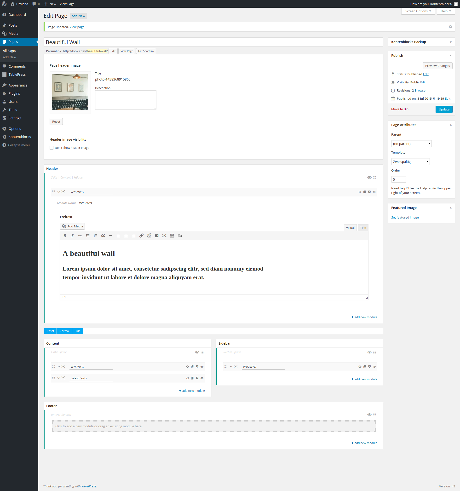
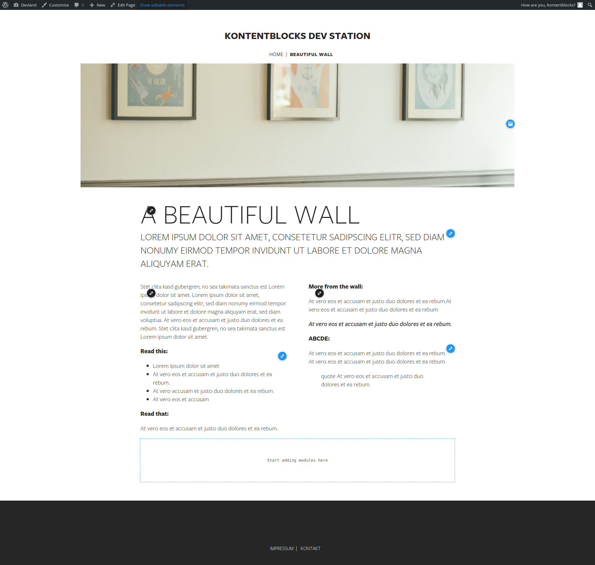

*Getting started*

##Terminology, work flow & concept

The core feature of Kontentblocks can be summarized as sidebars and widgets on a per-post basis.  
The term 'post' relates to any post type.  
The plugin does not share any code with WordPress sidebars and widgets, which means:  

- Kontentblocks won't affect your sidebars or widgets  
- Sidebars and widgets are not (re)usable by the plugin

So, if you have ever worked with sidebars and widgets, you already have an good idea of the basic concept.

To avoid confusion between WordPress core concepts and Kontentblocks, different terms are used.  
Following are brief overview of the most used terms when working with Kontentblocks.

#### Context

You might know this term from meta boxes.
A context is basically a container for areas.  
The post edit screen can be divided into different contexts, and a context can hold multiple areas.

#### Areas 

An area, like a WordPress sidebar, is basically a container for modules.

####Module

Similar to a WordPress widget, a module is basically a container with a form for user input on the back-end and (HTML) output on the front-end.  

#### Fields

Kontentblocks comes with it's own Fields API.  
It's recommended to use the API, and if you want to make use of the inline editing capabilities, it's a must.

#### Panels

Panels are static containers for settings and coupled to the built-in Fields API. There are two kinds of panels:

- **PostPanel**  
  Attached to a post (any post type), either as meta box or a custom fixed container.  
  Supports inline/front-end editing.
- **OptionsPanel**  
  Attached to the WordPress admin menu as a sub-item or main menu item.  
  Does not support inline/front-end editing but (most) fields can be attached to the WordPress customizer as a panel with sections.

This screenshot described from top to bottom:

- A simple PostPanel for the page header image
- The main Kontentblocks user interface with four contexts:
    - top
    - content | side
    - bottom

Each context has one attached area.

The layout of the edit screen is just an visual aid and can be changed by using custom context layouts (via filter).
The screenshot shows the default layout when all contexts have an area attached. Empty contexts are not visible.

The front-end view of the same page.  
Module and inline controls are turned on (via admin bar switch).  
Blue buttons activate inline-editing, black buttons are for module controls.  