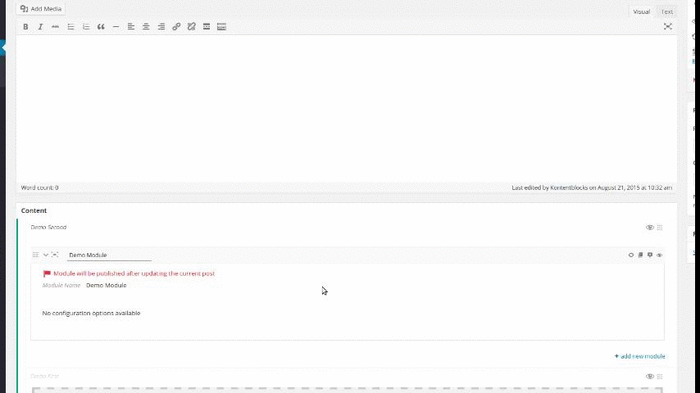

*Getting Started*

##Create a user input form for the module with built-in fields

Using the built-in fields API is an option, not a requirement.  
It has some benefits like:
- saving handled automatically
- form field creation
- some fields have support:
    - inline editing
    - customizer integration

***
*technical insights*
###Module->fields() method

If a `fields()` method is present in the extending module class, an instance of the `ModuleFieldController` class gets assigned to the `$this->fields` module property.  

The controller has following method available to you:

#####ModuleFieldController->addGroup( $groupId, $args = array() )

By calling `addGroup()` on the controller you create a new empty section, which is an instance of the `FieldSection` class.  
Sections are rendered as tabs by default.

The `FieldSection` class offers a `addField()` method.

#####FieldSection->addField( $type, $key, $args );

***

###Add a text input and editor to the module

Open up your `DemoModule.php` file and add the following to it:

```php
    public function fields()
    {
        // create group and add fields in one run
        $this->fields->addGroup( 'section1', array( 'label' => 'Group of fields' ) )
                     ->addField(
                         'text', // field type
                         'headline', // field key
                         array(
                             'label' => 'Headline',
                             'std' => 'Lorem Ipsum' // Default value
                         )
                     )
                     ->addField(
                         'editor', // field type
                         'longtext', // field key
                         array(
                             'label' => 'Editor',
                             'media' => true, // enable add media button 
                             'std' => '<h2>Hello World</h2><p>Lorem Ipsum...</p>'
                         )
                     );
    }
```
    
    
This creates a section with the internal id of `group1` and adds two fields in the same step.  
The `key` is used to access the data later on.

An alternative way of writing the above with the same result would look like this:

    ```php
    public function fields()
    {
        // create group and add fiels in a seperate step
        /** @var FieldSection $group1 */
        $section1 = $this->fields->addGroup( 'section1', array( 'label' => 'Editor' ) );

        $section1->addField(
            'text', // field type
            'headline', // field key
            array(
                'label' => 'Headline',
                'std' => 'Lorem Ipsum'
            )
        );
        
        $section1->addField(
            'editor', // field type
            'longtext', // field key
            array(
                'label' => 'Editor',
                'media' => true, // enable add media button
                'std' => '<h2>Hello World</h2><p>Lorem Ipsum</p>'
            )
        );
    }
    ```

In that case you could pass a section to a custom filter or other manipulating functions.

Visit the edit screen of a page and add a new module if not already done, or reload.  
If all is correct, it looks like this:

